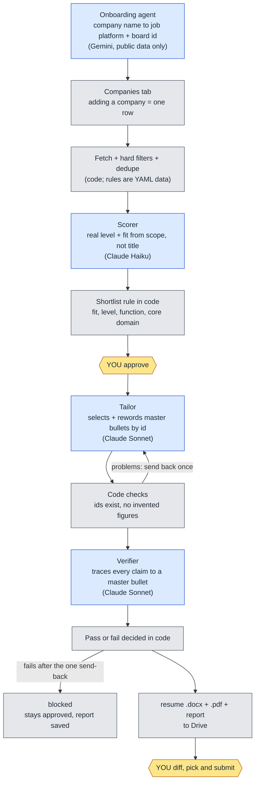

# JobAgent


A multi-agent job-search pipeline for senior engineering leadership roles. It finds postings, filters and
scores them, tailors a resume from a master resume, and **checks every claim before a human ever sees it**.
It stops before submitting: only a person approves a job or applies.

The design principle is **LLMs for judgment, code for control.** Models do the work that needs reading and
writing (judging level and fit, rewording bullets, checking claims). Plain, tested Python decides what is
allowed to happen: state changes, thresholds, pass or fail, and every safety rule.

```bash
uv sync && uv run jobagent demo        # free, offline, no API keys: the whole pipeline on fictional data
```

## Why I built this

I am an engineering leader looking for Director and VP roles, and doing that well is slow: finding roles,
judging which ones fit my level, and tailoring a resume without stretching the truth. I wanted the repetitive
parts automated while keeping the parts that need trust under strict control: nothing may be claimed that is
not in my master resume, and nothing is submitted without me. It was also a way to learn LLM engineering by
building something I can defend decision by decision, with measurements instead of impressions.

## Demo

`jobagent demo` runs the real pipeline code on six fictional postings. Only the model call is replaced by
answers **recorded from real runs**, so it is free and offline, and it says so on screen. A condensed excerpt of its output:

```text
2. Fetch and filter: hard rules run before any model is called
   Senior Manager, Platform Engineering                 kept
   Associate Vice President, Application Development   filtered out (rule:no-inflated-vp-titles)
   Principal Software Engineer, Distributed Systems     filtered out (include:title)
   Director of Engineering, Payments                    kept
   Vice President, Engineering                          kept
   6 postings fetched, 2 filtered out by rules, 4 kept. Cost so far: $0.00, no model involved.

3. Score: the Scorer judges level and fit; code decides the shortlist
   Senior Manager, Platform Engineering   senior_manager (high)   fit 88   core domain true    shortlisted
   Director of Engineering, Payments      director (high)         fit 88   core domain true    shortlisted
   Vice President, Engineering            vp (high)               fit 78   core domain true    shortlisted
   Director, Mobile Engineering           senior_manager (high)   fit 62   core domain false   scored
   Shortlist rule, in code: fit >= 70, level in [senior_manager, director, vp], core domain covered.

4. Your decision: only a human can approve a job
   You review the shortlist and approve one:  jobagent approve aacd0950277f
   (The demo plays your part. The pipeline itself can never do this step.)

5. Tailor and verify: reword from your master resume, then check every claim
   Status: ready after 1 attempt(s). The Verifier checked 7 claims; every one must trace to a master bullet.

7. Safety: what if the model invented something?
   Injected on purpose: bullet nf-d-1 now says "... across 40 markets" (not in your master).
   Stopped by plain code, before any model call: bullet 'nf-d-1' contains figures ['40'] not in the source bullet

8. Result
   Resume tailored and verified     ready (7 claims traced)
   Submitted anywhere               nothing: a human submits, never the pipeline
```

## Architecture



Every job moves through one state machine, and only the orchestrator (plain Python) changes state:

```text
new → filtered → scored → shortlisted → approved → tailored → verified → ready → submitted
                                          ▲ human only                              ▲ human only
```

| Agent | Job | Model | Status |
|---|---|---|---|
| Company Onboarding | Company name to job platform and board id, validated by fetching a real posting | Gemini Flash-Lite (free tier, public data only) | built |
| Level + Fit Scorer | Classifies the real level from scope signals, judges fit and whether the role's core domain is in the resume | Claude Haiku 4.5 | built |
| Tailor | Selects and rewords master-resume bullets by id | Claude Sonnet 5.5 | built |
| Verifier | Traces every claim to a master bullet; flags inflation and wrong-level framing | Claude Sonnet 5.5 | built |
| Application | Pre-fills forms and pauses before Submit | planned | not built |
| Career Gap Analyst | Weekly: recurring gaps across scored postings | planned | not built |

Job platforms are read through one adapter class each behind a common interface: **Ashby, Greenhouse, Lever,
Workday** (Workday uses an unofficial endpoint and is the most fragile). Storage sits behind an interface too
(a Google Sheet today, local CSV as a fallback, Postgres later), and so do the model providers (Claude and Gemini).

## Design decisions and trade-offs

- **A deterministic orchestrator, not an LLM one.** The steps are known, so a fixed state machine is cheaper,
  testable and predictable. The cost is that it cannot improvise on a case nobody planned for. That is the right
  trade for a process where a wrong action means a false claim to an employer.
- **The Tailor works by bullet id, and code checks it first.** The Tailor cannot write free text: it picks master
  bullets by id and cites support for every sentence. Plain code then rejects unknown ids and any number that is
  not in the source bullet, *before* a Verifier call is spent. Job titles, employers and dates are copied by code
  and cannot be changed.
- **The model gives evidence; code makes the decision.** The Verifier returns a verdict per claim, and a job passes
  only if every claim is `traced`. The shortlist is a rule in code over the Scorer's structured output. An early
  attempt to have the prompt cap scores for missing core skills was ignored by the model; a plain yes/no question
  (`core_domain_covered`), enforced in code, worked.
- **Everything omitted is restored verbatim.** By default the finished resume keeps every role and bullet from the
  master. Whatever the Tailor leaves out is copied back unchanged after verification, so tailoring can only
  reorder and reword, never quietly drop experience.
- **Rules are data.** Filters are a short YAML list (`exclude`, `include`, `flag`, optionally scoped to a company),
  validated strictly so a typo fails loudly. Adding a company is one row; adding a level is a config edit.
- **A workflow, not a free-roaming agent.** The steps are known and the cost of an error is high, so each agent has
  one job and bounded retries (one send-back). The closest thing to an open-ended agent is Onboarding.
- **Platform detection is code, not generated code.** Onboarding asks a model only where to look (a domain and likely
  careers pages), then fetches pages, recognises platform links, and validates by reading real postings. Anything
  unclear becomes `needs_review` with a reason, never a guess.

## Safety and guardrails

- **No auto-submit.** Only a human can move a job to `approved` or `submitted`; the state machine rejects it from
  code, and a submitted job can never return to `approved`.
- **No fabrication path.** Every claim traces to a master-resume bullet or the job is blocked and a report says why.
- **Free tiers never see the resume.** A free-tier provider refuses to serve the Scorer, Tailor or Verifier
  (a `PolicyError`), so a misconfiguration fails instead of leaking private data.
- **Private data stays private.** The master resume and personal filter rules are git-ignored and reach the
  scheduled run as encrypted secrets. The example files committed here are fictional.
- **Polite fetching.** Each platform has a cooldown between fetches (6h for Ashby, Greenhouse and Lever; 20h for
  Workday), including after a failure, so reruns do not hammer a site.
- **Spend caps.** Scoring and tailoring stop at a configured dollar cap per run.

## Evaluation

`jobagent eval scorer|verifier|all` runs labelled cases and logs every metric to an Evals tab with the model, the
prompt version and a fingerprint of everything the model was told. All cases are fictional.

| Eval | Result | Target |
|---|---|---|
| Scorer level accuracy, first 9 cases | 8/9 (89%) | 90% |
| Same cases plus 4 held-out, before fixing the profiles | 10/13 (77%); held-out 50% | 90% |
| After defining the missing levels in the profiles | 12/13 (92%); held-out 100% | 90% |
| After fixing a side effect the first fix caused | 13/13 (100%) | 90% |
| Verifier: fabrications that got through (4 injected) | 0 | 0 |
| Verifier: clean drafts wrongly rejected (2) | 0 | 0 |

The Verifier eval replays the real defence order: free code checks first (one injected invented number was caught
there, with no model call), then the model for what code cannot judge (it caught an inflated verb, an invented tool
and executive-level framing). Running each Scorer case three times gave identical answers, so a regression is a
real regression and not noise.

**Honest caveats.** Thirteen cases is thin: one miss moves the score by almost eight points. The "held-out" cases
informed the second fix, so they no longer count as held out; a 100% here is a regression guard, not proof of
accuracy. Synthetic postings may be easier than real ones. The Onboarding agent resolved 8 of 11 test companies
correctly on the first try with no wrong activations; the other three came back as `needs_review` with a reason.

## Cost

Measured from real runs, with Claude Haiku 4.5 for scoring and Sonnet 5.5 for tailoring and verifying:

| Stage | Cost |
|---|---|
| Fetch, filter, dedupe | free (no model) |
| Score a posting | about $0.004 to $0.008 |
| Tailor and verify one job | about $0.03 to $0.07; about $0.13 when the Verifier sends it back once |
| Onboard a company | free tier |
| A daily run scoring 33 new postings | about $0.14, capped at $1 |

## Quickstart

```bash
uv sync
uv run jobagent demo                                    # free, offline: see the whole pipeline first
cp config/master_resume.example.yaml config/master_resume.yaml     # then replace with your true experience
cp config/criteria.example.yaml config/criteria.local.yaml
cp .env.example .env                                    # add your keys; see docs/setup.md for Google and Drive
uv run jobagent add-company "Some Company" --tier A
uv run jobagent run && uv run jobagent score --limit 10
uv run jobagent shortlist                               # review, then: jobagent approve <job_id>
uv run jobagent tailor                                  # tailor + verify, saved to Drive
```

Full setup (keys, Google Sheet, Drive, secrets): [docs/setup.md](docs/setup.md).

## Daily automation

`.github/workflows/daily.yml` runs `jobagent daily` every day and on demand: onboard new companies, fetch and
filter, score what is new. It never approves, tailors or submits. Because the repository is public the workflow is
locked down: it triggers only on a schedule or a manual dispatch (never on pull requests), uses a read-only token,
pins every action to an exact commit, disables package caching, has a timeout, and passes secrets only to the one
step that needs them. The log prints counts and costs only, never company names, job titles or resume text, and
tests enforce all of this. A separate `tests.yml` runs lint and the suite on pull requests with no secrets at all.

## Repository layout

```text
src/jobagent/
  adapters/ats/    one class per job platform (Ashby, Greenhouse, Lever, Workday)
  agents/          Scorer, Tailor, Verifier, shared prompt and runner code
  onboarding/      platform detection and the Onboarder
  orchestrator/    state machine, pipeline, scoring, tailoring, daily run, deterministic checks
  llm/             provider interface with Claude and Gemini adapters
  documents/       .docx and PDF rendering, diff view, Verifier report
  evals/           eval harness   ·   demo/  record-and-replay demo
  storage/         Sheet, CSV and Drive behind interfaces
config/            committed settings and examples; your resume and personal rules are git-ignored
prompts/           versioned prompts (the version is logged with every score and eval)
evals/data/        fictional eval cases
.github/workflows/ daily run and test workflows
```

## Limitations and roadmap

- **The Application agent is not built.** The plan is Playwright form pre-fill that pauses before Submit, local only.
- **Workday is an unofficial endpoint** and may change without notice; SmartRecruiters and an aggregator fallback are not built.
- **Single user, Google Sheet as the store.** Fine for one person; slow and rate-limited for anything larger.
  A database and a local web UI are possible next steps.
- **The Verifier checks traceability, not truth.** It confirms a claim matches your master resume; it cannot know
  whether the master itself is accurate.
- **Small eval set** (see the caveats above), and the Scorer's accuracy on real postings is not yet measured.
- **Changing a prompt or profile invalidates the demo recording.** Refresh it with `jobagent demo --record`
  (a few cents of API calls); a test fails until you do, on purpose.

## License

MIT, see [LICENSE](LICENSE).
